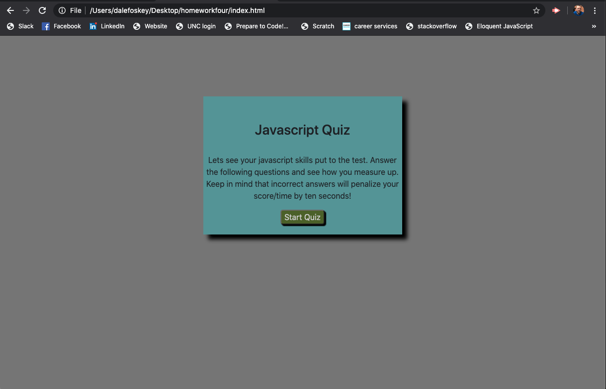
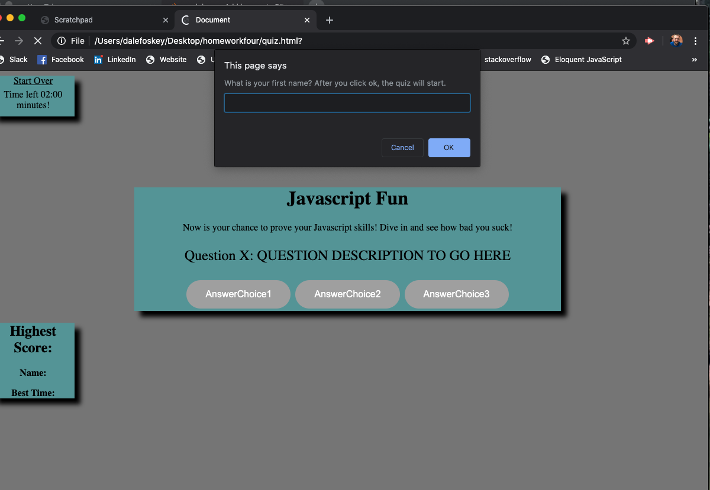
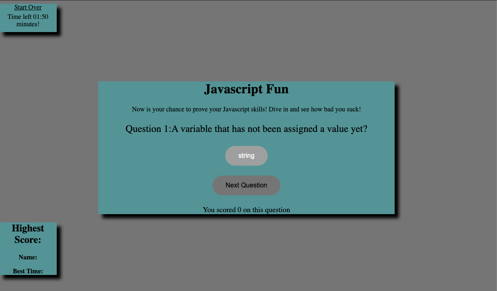
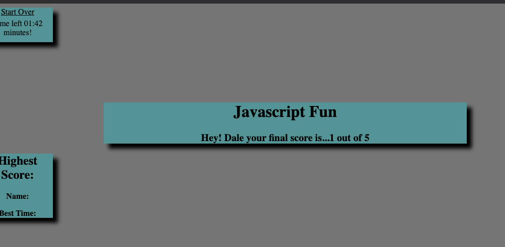

# Homework Assignment 4: Javascript Question Game
---

## Description
This project is my 4th project deployed while taking the Web Developer Bootcamp at UNC.  It provides a fun approach at learning javascript by playing a game. All of this was created with HTML, CSS, Javascript, Jquery, Bootstrap only.

## Getting Started
---
These instructions will get you a copy of the project up and running on your local machine for development and testing purposes. See deploying the game for notes on how to deploy the project on a live system.

## Prerequisites
---
Windows or Mac file expolorer
Working web browers (ie Chrome browser, Mozilla Firefoxi)
Code editing software (ie Sublime text, Visual Studio Code)
Terminal window
internet access

## Installation
---
Using your filesystem explorer locate the html and css files
Then either open the html files in browser for inspection, or using your choice of code editor to edit.

## Deploying the Game
---
From any web browser visit this site  https://jdalefoskey.github.io/homeworkfour/  to begin playing

## Repository contents
---
All files for the GitHub pages site reside in the docs/ directory. HTML, CSS, and JS files above the docs/ directory were used only to submit the homepage for the project.

css/
portfolio.css: CSS stylesheet for the webpage
docs/
Files for GitHub Pages Jekyll website.
img/
Images used in the webpage
js/
portfolio.js: jQuery JavaScript for the webpage
index.html: Main webpage. A modified version of the page is stored as docs/index.html for the GitHub Pages website.
README.md: concise description of the repository for GitHub

